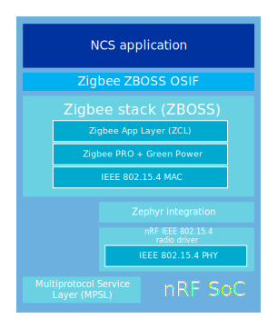

.. _ug_zigbee_integration:

Zigbee integration
##################

.. contents::
   :local:
   :depth: 2

The Zigbee protocol in the |NCS| relies on the third-party precompiled ZBOSS stack that is available in the :ref:`nrfxlib:zboss` library in nrfxlib (version |zboss_version|).
Between the ZBOSS stack and the |NCS|, the :ref:`lib_zigbee_osif` subsystem acts as the linking layer that implements a series of functions used by ZBOSS.
The |NCS|'s Multiprotocol Service Layer (MPSL) driver allows running Bluetooth LE and Zigbee concurrently on the same radio chip.

   Zigbee integration overview

Any Zigbee application based on the ZBOSS stack must match the predefined `application structure`_, as described in the ZBOSS API documentation user guide.
